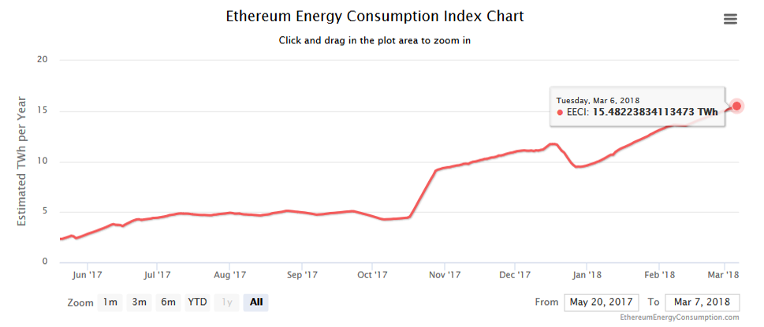

**Navigation**
* [Accueil](index.html)
* [Présentation d'Ethereum](ethereum.html)
* [Qu'est-ce qu'un smart-contract ?](smartcontracts.html)
* [Les applications de ces contrats](applications.html)
* [Exemples de code Solidity](exemples.html)
* [Sécurité des smart-contracts](securite.html)
* [**Le futur de la technologie**](futur.html)
* [Bibliographie](bibliographie.html)

___
# Le futur de la technologie

## Limitations actuelles

### Consommation énergétique

Le consensus par _Proof of Work_ consomme de très grosses quantités d'énergies pour faire fonctionner le réseau.
Grâce à des améliorations comme une bande passante plus élevée, Ethereum arrive à moins consommer d'électricité que Bitcoin alors qu'il traite plus de transactions.

Cependant, l'énergie consommée reste rédhibitoire : elle est, d'après [https://digiconomist.net/ethereum-energy-consumption](https://digiconomist.net/ethereum-energy-consumption),
aussi importante que l'énergie consommée par la République dominicaine !

Sources : [https://digiconomist.net/ethereum-energy-consumption](https://digiconomist.net/ethereum-energy-consumption)

### Vulnérabilités

Comme mentionné précédemment, la technologie est jeune et les vulnérabilités sont un des plus gros problèmes actuels
pour la démocratisation des smart-contracts. La maintenabilité est difficile, et toute erreur peut avoir de très grosses
conséquences.

### Manque de régulation

Un autre point noir qui empêche actuellement une utilisation des smart-contracts par un grand nombre de personnes est le manque de régulation.
De nombreuses arnaques (Ponzi schemes) sont présentes, les marchés des cryptomonnaies sont fortement manipulés (Pump and dumps), et cela attire les
acteurs malveillants.

### Passage à l'échelle du nombre de transactions traitées par le réseau

Enfin, il est important de mentionner qu'à l'heure actuelle, Ethereum ne peut pas gérer plus d'une quinzaine de transactions par seconde.

En décembre 2017, un jeu décentralisé, [CryptoKitties](https://www.cryptokitties.co/), est devenu très populaire et a amené une demande importante de transactions de la part de ces utilisateurs.
Le réseau ne pouvait pas en traiter autant, ce qui a eu pour double conséquence d'allonger les temps d'attente et d'augmenter fortement le coût des transactions.

Un article de Bloomberg mentionnant le phénomène est disponible ici : [
CryptoKitties Mania Overwhelms Ethereum Network's Processing](https://www.bloomberg.com/news/articles/2017-12-04/cryptokitties-quickly-becomes-most-widely-used-ethereum-app)

Ainsi, il semble impossible que le réseau actuel puisse être utilisé par plusieurs applications grand publique, à l'heure où les quantités de données traitées explosent.

## Roadmap

### Transactions hors-chaîne

Afin d'augmenter le nombre possible de transactions traitables par la blockchain, des solutions, dites "hors-chaîne", sont en développement. [Raiden Network](https://raiden.network/)
se base sur le même principe que le Lightning Network de Bitcoin, [lancé le 16/03/2018 sur le main-net en version bêta](https://twitter.com/lightning/status/974299189076148224).

Si ce projet réussit et que l'adoption est importante, le nombre de transactions qui peuvent être réalisées par Ethereum pourrait être considérablement augmenté.

### Passage à la _Proof of Stake_ (POS)

Prévue pour 2018 / 2019, la mise à jour Casper du protocole d'Ethereum prévoit de passer à un processus de consensus beaucoup moins consommateur en énergie que la _Proof of Work_, la _Proof of Stake_.

### Sharding

Une autre solution potentielle pour le passage à l'échelle est le _sharding_, qui consiste en la parallélisation des transactions du réseau en divisant les noeuds en _shards_.
Ce procédé, qui peut être récursif afin de créer un _arbre de shards_, permettrait lui aussi d'augmenter considérablement le nombre de transactions possible.

## Conclusions

Finalement, Ethereum est une technologie jeune et le principe des smart-contracts est très innovant. De nombreuses applications de cette technologie sont en cours de développement,
mais la technologie doit devenir plus mature, autant par la recherche que par les outils proposés aux développeurs, afin d'être utilisable au quotidien dans des applications grand public.

À lire ensuite : [**Bibliographie ->**](bibliographie.html)

___
[Me contacter](mailto://leo.besancon@ecl14.ec-lyon.fr)

Suivez mon flux Twitter : [@ecl_lb](https://twitter.com/ecl_lb) !
